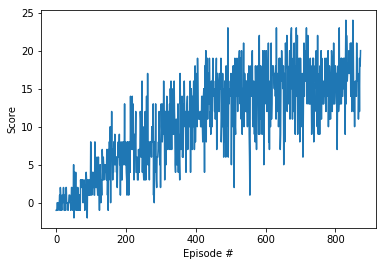

# Navigation in a banana field

## Environment
Unity Machine Learning Agents ([ML-Agents](https://github.com/Unity-Technologies/ml-agents)) is an open-source Unity plugin that enables games and simulations to serve as environments for training intelligent agents. 

This repo presents code and step by step guide on how to train an intelligent agent to solve the [Banana-collector environment](https://github.com/Unity-Technologies/ml-agents/blob/master/docs/Learning-Environment-Examples.md#banana-collector).

In this Banana-collector environment, a reward of +1 is provided for collecting a yellow banana, and a reward of -1 is provided for collecting a blue banana. Thus, the goal of the agent is to collect as many yellow bananas as possible while avoiding blue bananas.

The state space has 37 dimensions and contains the agent's velocity, along with ray-based perception of objects around the agent's forward direction. Given this information, the agent has to learn how to best select actions. Four discrete actions are available, corresponding to:

    0 - move forward.
    1 - move backward.
    2 - turn left.
    3 - turn right.

## Goal
This task is episodic, and in order to solve the environment, the agent must get an average score of at least +13 over 100 consecutive episodes.

As an example, consider the plot below, where we have plotted the score obtained with each episode.  

  
The environment is considered solved, when the average score (over 100 consecutive episodes) is at least +13.

## Result
A movie clip demonstrating successfully trained agents (achieving an average score of +16) is shown below. The trained agent has learned to move towards yellow bananas while trying to avoid blue bananas in front by either turning left or right or backing up.   

  

## Dependencies
* Numpy
* Matplotlib
* PyTorch (0.4.0 or above)
* ML-Agents toolkit (`pip install unityagents`) 

## Usage
* The Windows (64-bit) version of the environment is provided in this repo in the folder "Banana_Windows_x86_64".
* Mac OSX version can be downloaded [here](https://s3-us-west-1.amazonaws.com/udacity-drlnd/P1/Banana/Banana.app.zip)
* Linux version can be downloaded [here](https://s3-us-west-1.amazonaws.com/udacity-drlnd/P1/Banana/Banana_Linux.zip)

Follow the step by step instructions in **Report.ipynb** to start running the environment and training the agents.

